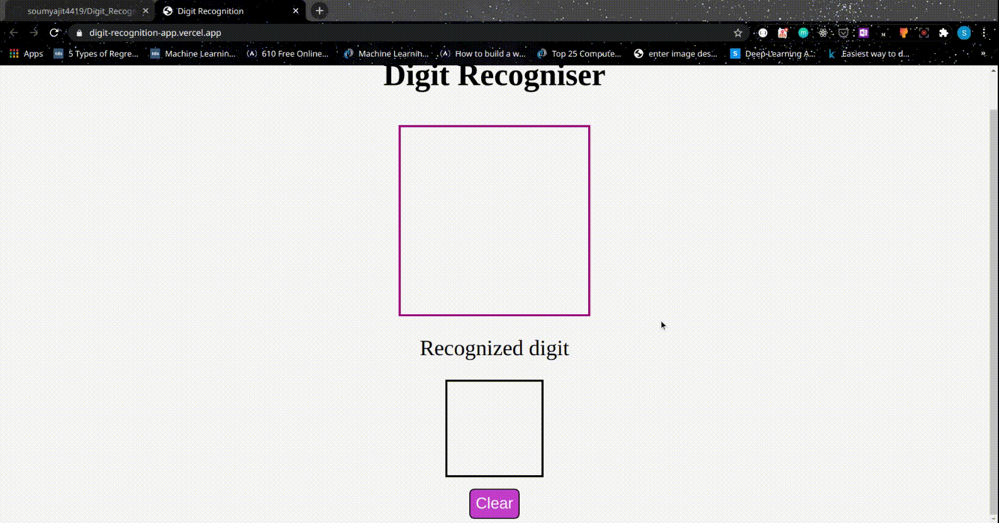

## Project Name

#### Digit Recogniser 

## Project Description
* I have used the MNIST Data to train the model which has an accuracy of 99.1%
* I have converted the `.hdf5` file into `.json` using Tensorflow.js
* Then i have used the model for recognisation of digits using simple javascript code.

### Methods Used
* Deep Learning
* MNIST
* Image Classification
* CNN

### Technologies 
* Python
* Keras
* Tensorflow
* Tf.js

### Usage

